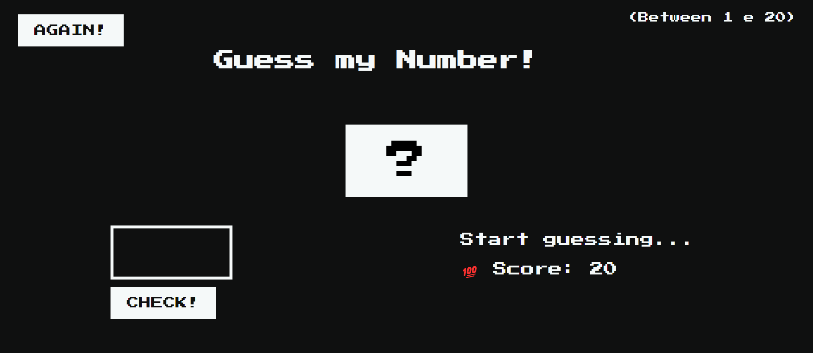

### The project

In this project I created a game where the player needs to guess which number is between 1 and 20.
In addition, the player can see his points and also the highest score in the game.
It's a simple game to improve my JavaScript skills. 
The player needs to find out what the secret number is. For this, the player starts by typing a random number.
If the number entered is lower or higher than the number that needs to be discovered, a message appears saying 'too high' or 'too low'.
And then the player can enter other numbers until he finds out the secret number.
When the player discovers the secret number, the game screen changes color and a message appears saying the number is correct.

### Screenshot

.png)

### Built with

- Semantic HTML5 markup
- CSS custom properties
- JavaScript

## Author

- LinkedIn - (https://www.linkedin.com/in/kadipukki/).